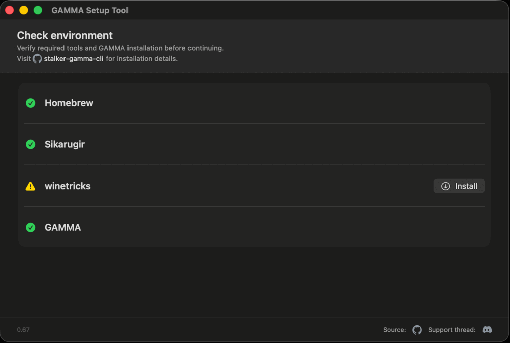

# GAMMA Setup Tool

Native macOS tool for creating a Sikarugir `.app` wrapper around an existing S.T.A.L.K.E.R. G.A.M.M.A. installation.

GAMMA Setup Tool does not install G.A.M.M.A. itself. It expects G.A.M.M.A. to already be installed.

## Flow Demonstration



## Description

The tool asks for the folder that contains `ModOrganizer.exe`, then creates an `.app` wrapper that is ready to run. Keep in mind that the tool does not perform any validation of the G.A.M.M.A. installation itself.

There are several options to tweak, but changing them is not required. You can just go through the flow with the defaults; that was the goal.

I have also tried to provide tips and additional info if you choose to change any default settings. Most of those notes are based on my personal experience running different X-Ray engine games on macOS, so your experience may vary. Feel free to correct anything that looks extremely stupid or plain wrong.

You can re-run the setup for an already-created wrapper as many times as you want. It is idempotent and will adjust the prefix according to your selected options. If you encounter problems or need help, ping me in the support thread. I am on and off Discord due to life stuff, but I will get back to you as soon as I can.

## What It Does

The app uses your selected `ModOrganizer.exe` path, then creates a native macOS app wrapper that launches G.A.M.M.A. through ModOrganizer.

The guided flow handles:

- ModOrganizer folder selection.
- Required winetricks dependencies.
- Wine prefix options + Optional fixes

## How to Use

## How to use

Use the latest GitHub release and download the app archive:

```text
GAMMA.Setup.Tool.<version>.app.zip
```

Unzip it, then run:

```text
GAMMA Setup Tool.app
```

macOS may require approving the app in System Settings because the release is not notarized.

### Wine Display Resolution

The Display section is for choosing whether Wine should use its default display behavior or expose a specific resolution to Windows apps. This is mainly useful when using BetterDisplay or another HiDPI display mode where macOS may show a 1080p desktop while the backing pixel mode is larger.

The tool detects the current macOS display mode, including HiDPI/backing resolution when available.

`Default Wine` is the default for new wrappers and keeps Sikarugir's normal display behavior. `Forced` writes Wine's Retina mode and DPI settings so Wine presents the selected resolution as a plain Windows display.

If setup is re-run after using `Forced`, choosing `Default Wine` removes the Wine display keys managed by the setup tool.

For a BetterDisplay `1080p HiDPI` desktop, use `Forced` with the detected `1920 x 1080` option only when you want Wine to expose that exact display mode.

For deeper technical notes on macOS scaling, Wine DPI behavior, and monitor geometry, see [DPI awareness, monitor geometry](https://github.com/elseform/gamma-setup-tool/wiki/DPI-awareness,-monitor-geometry).

## Developer Notes

### Build

Build the app:

```text
swift build
```

Building from source requires Apple's Command Line Tools or Xcode.

SwiftPM writes build products under:

```text
.build/
```

For UI iteration, build and immediately run the app target:

```text
swift run GAMMASetupTool
```

Build artifacts, Swift module cache, and intermediates are kept under `.build/` so repeat builds are faster. To remove them:

```text
swift package clean
```

### Source Layout

Swift GUI sources live in:

```text
sources/GAMMASetupTool/
```

The app is split into:

- `AppModel.swift`: setup state, process streaming, and option serialization.
- `Components.swift`: reusable SwiftUI rows, tips, icons, and wizard step metadata.
- `ContentView.swift`: wizard layout and screens.
- `GAMMASetupToolApp.swift`: app entry point.
- `sources/GAMMASetupCore/`: shared setup engine models, path helpers, CLI preflight support, and installation services.
- `sources/GAMMASetupEngine/`: the setup backend launched by the GUI.

The Swift package builds both the GUI and the `gamma-setup-engine` backend.

### Setup Engine Details

`gamma-setup-engine` performs these operations:

- Installs or verifies Homebrew tap `sikarugir-app/sikarugir` and Sikarugir Creator during wrapper installation, before wrapper creation.
- Uses the selected `ModOrganizer.exe`; the CLI can still read `stalker-gamma-cli` settings from `~/Library/Application Support/stalker-gamma/settings.json` as a fallback.
- Reads `<gammaPath>/ModOrganizer.ini` for context only and never modifies it. Default installation uses Wine's standard `Z:` host-path mapping.
- Creates a Sikarugir app wrapper.
- Downloads or reuses cached Sikarugir template and engine archives.
- Extracts the engine into the wrapper.
- Initializes the Sikarugir Wine prefix inside the wrapper.
- Uses Wine Sikarugir 10.0 and D3DMetal by default, or DXMT/DXVK when selected.
- Sets `WINEESYNC=0` and `WINEMSYNC=1` on newly created wrappers. Existing-wrapper updates preserve current plist values for removed Sikarugir Configure settings.
- When a Wine display resolution is selected, writes Wine Retina/DPI compatibility settings.
- Sets the wrapper launch path to `/mo2.bat`.
- Creates a Finder alias named `Configure <wrapper name>` beside the wrapper, targeting the wrapper's `Contents/Configure.app`.
- Advanced installation can add `G:` at the directory containing the selected GAMMA folder when existing ModOrganizer paths require it.
- Updates ModOrganizer's `usvfs` binaries from bundled files when selected.
- Installs bundled GPTK4 D3DMetal binaries by default.
- Installs required Wine dependencies with `winetricks`: `corefonts`, `d3dx9_43`, `d3dx11_43`, `d3dcompiler_47`, and `vcrun2026`.
- Reuses a compatible installed `winetricks` CLI when available and otherwise downloads one current script into the setup tool's shared cache without modifying the Homebrew installation.
- Applies DLL overrides for DirectX and Visual C++ runtime DLLs, preferring native `concrt140` with Wine's built-in implementation as fallback.
- Creates `drive_c/mo2.bat`, which sets ModOrganizer Qt rendering variables before starting `ModOrganizer.exe`.
- Detects existing wrapper state from wrapper files such as `Info.plist`, Wine registry files, `wine/version`, bundled payloads, batch files, and symlinks. Old marker files are left untouched but ignored.

### Logs And Cache

Top-level setup logs are optional. Enable `Save verbose log` in the GUI to create a log in `~/`:

```text
gamma-setup-tool.YYYYMMDD-HHMMSS.log
```

Dry-run logs use:

```text
gamma-setup-tool.dry-run.YYYYMMDD-HHMMSS.log
```

Logs are ignored by git.

Downloaded Sikarugir assets are cached in:

```text
~/Library/Caches/stalker-gamma-sikarugir-setup
```

The shared `winetricks` script and its installer payloads are cached beside the setup tool's `settings.json`:

```text
~/Library/Application Support/gamma-setup-tool/cache/winetricks
```

New wrappers still install the required components into separate Wine prefixes, but reuse payloads from this cache instead of downloading them again.

If Sikarugir Creator has already downloaded the template or engine, the setup engine reuses those local assets from:

```text
~/Library/Application Support/Sikarugir
```

Generated build products, Swift module cache, and intermediate binaries are written to `.build/`, which is ignored by git.
