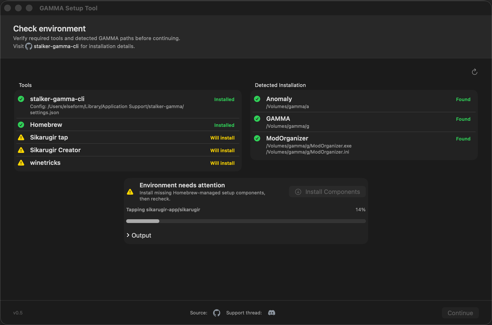

# GAMMA Setup Tool

Native macOS tool for creating a Sikarugir `.app` wrapper around an existing S.T.A.L.K.E.R. G.A.M.M.A. installation.

GAMMA Setup Tool does not install G.A.M.M.A. itself. It expects G.A.M.M.A. to already be installed with [`stalker-gamma-cli`](https://github.com/FaithBeam/stalker-gamma-cli/wiki/MacOS-Install).




## What It Does

The app reads your `stalker-gamma-cli` config and `ModOrganizer.ini`, then creates a native macOS app wrapper that launches G.A.M.M.A. through `ModOrganizer.exe`.

The guided flow handles:

- Environment checks for `stalker-gamma-cli`, Homebrew, Sikarugir, `winetricks`, Anomaly, GAMMA, and ModOrganizer files.
- Wine prefix options, including D3DMetal or DXMT, MoltenVK-CX, MoltenVK fast math, Metal HUD, documented DXMT settings, and Wine drive mapping.
- Required winetricks dependencies.
- Optional extra winetricks verbs.
- Optional D3DMetal/DXMT reflex reticle fix.

Default wrapper name: `stalker-gamma`. The `.app` extension is added automatically.

## Requirements

- macOS 13 or newer.
- G.A.M.M.A. installed through `stalker-gamma-cli`.
- Homebrew.

After those base requirements are present, the app can install or prepare the wrapper dependencies it needs:

- Sikarugir tap
- Sikarugir Creator
- `winetricks`
- Sikarugir wrapper template
- Sikarugir Wine engine
- Required Wine dependencies:
  - `corefonts`
  - `d3dcompiler_43`
  - `d3dcompiler_47`
  - `d3dx9`
  - `d3dx10`
  - `d3dx11_43`
  - `vcrun2022`

The app does not install Homebrew, `stalker-gamma-cli`, or G.A.M.M.A.

## Download

Use the latest GitHub release and download:

```text
GAMMA.Setup.Tool.0.6.app.zip
```

Unzip it, then run:

```text
GAMMA Setup Tool.app
```

macOS may require approving the app in System Settings because the release is not notarized.

The release also includes `D3DMetal DXMT Reflex Reticle Fix v2.7z` as a standalone MO2 mod archive for users who want the reticle fix without using the setup tool.

## How to use

1. Open `GAMMA Setup Tool.app`.
2. Let the Environment screen verify required tools and detected paths.
3. Configure wrapper name, output directory, prefix options, and optional fixes.
4. Create the wrapper.
5. Start the app.

The recommended renderer is D3DMetal. DXMT is available as an alternative and exposes documented DXMT options:

- MetalFX spatial swapchain
- Preferred max frame rate through `DXMT_CONFIG`
- `DXMT_LOG_LEVEL`

## Additional Fixes

The app includes an optional D3DMetal/DXMT reflex reticle fix:

```text
mods/D3DMetal DXMT Reflex Reticle Fix v2.7z
```

This fixes missing red-dot and holographic sight reticles when running STALKER Anomaly/GAMMA through D3DMetal or DXMT.

When enabled, the tool downloads the latest matching GitHub release asset, extracts it into the detected MO2 `mods` directory as:

```text
D3DMetal DXMT Reflex Reticle Fix
```

It does not modify ModOrganizer profile files. Enable the mod manually in ModOrganizer after wrapper creation.

Manual install is also possible: install the archive as a normal MO2 mod, or copy the `gamedata` folder into the game directory so it overrides the original shader files.

After installing or updating this fix, clear the affected shader cache so the game recompiles the patched shaders:

- `appdata/shaders_cache/r4/models_reflex_reticle_3db.ps`
- `appdata/shaders_cache/r4/models_reflex_reticle_simple.ps`
- `appdata/shaders_cache/r4/models_reflex_reticle.ps`
- `appdata/shaders_cache/r4/models_reflex_reticle_simple_3db.ps`
- `appdata/shaders_cache/r4/models_lfo_light_dot_weapons.ps`
- `appdata/shaders_cache/r4/models_reflex_reticle.vs`

Deleting the whole `appdata/shaders_cache` folder is also fine; the game will rebuild it.

## Important Notes

- Existing apps are not silently overwritten. If the target exists and was not created by this tool, the setup engine exits unless `--replace` is used from the CLI.
- The wrapper launches ModOrganizer only.
- The tool reads `stalker-gamma-cli` configuration but does not write it.
- The tool reads `ModOrganizer.ini` and rewrites it only if it detects reserved `Z:` paths and the user explicitly accepts repair, or if `--assume-rewrite-z` is used from the CLI.
- GAMMA and Anomaly must already be installed and available at their detected paths.

## Developer Notes

### Build

Build the app:

```sh
./build.sh
```

Building from source requires Apple's Command Line Tools or Xcode because `build.sh` uses `swiftc`.

The built app is created at:

```text
dist/GAMMA Setup Tool.app
```

For UI iteration, build and immediately run the app:

```sh
./build.sh run
```

Build artifacts, Swift module cache, and intermediates are kept in `dist/` so repeat builds are faster. To remove them:

```sh
./build.sh clean
```

### Source Layout

Swift GUI sources live in:

```text
sources/GAMMASetupTool/
```

The app is split into:

- `AppModel.swift`: preflight state, setup execution, process streaming, and option serialization.
- `Components.swift`: reusable SwiftUI rows, tips, icons, and wizard step metadata.
- `ContentView.swift`: wizard layout and screens.
- `GAMMASetupToolApp.swift`: app entry point.

The build script compiles all `*.swift` files in that folder and stores intermediate binaries and the Swift module cache under `dist/`.

### CLI

The GUI wraps this script:

```text
sources/scripts/gamma-setup-tool.sh
```

Run the setup directly:

```sh
./sources/scripts/gamma-setup-tool.sh
```

Preview planned work without changing files:

```sh
./sources/scripts/gamma-setup-tool.sh --preview
```

Dry run:

```sh
./sources/scripts/gamma-setup-tool.sh --dry-run
```

Verbose dry run:

```sh
./sources/scripts/gamma-setup-tool.sh --dry-run --verbose
```

Custom wrapper path:

```sh
./sources/scripts/gamma-setup-tool.sh --output-app /private/tmp/stalker-gamma-test.app
```

Use DXMT instead of the default D3DMetal renderer:

```sh
./sources/scripts/gamma-setup-tool.sh --renderer dxmt
```

Enable MoltenVK fast math:

```sh
./sources/scripts/gamma-setup-tool.sh --moltenvk-fast-math
```

Enable Apple's Metal HUD:

```sh
./sources/scripts/gamma-setup-tool.sh --metal-hud
```

Enable documented DXMT options:

```sh
./sources/scripts/gamma-setup-tool.sh --renderer dxmt --dxmt-metalfx-spatial --dxmt-max-frame-rate 60 --dxmt-log-level info
```

Install extra winetricks verbs:

```sh
./sources/scripts/gamma-setup-tool.sh --extra-winetricks "quartz lavfilters"
```

Apply the optional D3DMetal/DXMT reticle fix:

```sh
./sources/scripts/gamma-setup-tool.sh --common-fix d3dmetal-reticle
```

Write a timestamped top-level log:

```sh
./sources/scripts/gamma-setup-tool.sh --log-file
```

### CLI Options

- `--output-app PATH`: target `.app` path. Default: `~/Applications/Sikarugir/stalker-gamma.app`.
- `--engine NAME`: Sikarugir engine name. Default: `WS12WineCX24.0.7_7`.
- `--renderer NAME`: graphics renderer, either `d3dmetal` or `dxmt`. Default: `d3dmetal`.
- `--moltenvk-fast-math`: sets `MVK_CONFIG_FAST_MATH_ENABLED=1` in the wrapper environment.
- `--metal-hud`: sets `MTL_HUD_ENABLED=1` in the wrapper environment.
- `--dxmt-metalfx-spatial`: sets `DXMT_METALFX_SPATIAL_SWAPCHAIN=1` when DXMT is selected.
- `--dxmt-max-frame-rate N`: appends `d3d11.preferredMaxFrameRate=N;` to `DXMT_CONFIG` when DXMT is selected.
- `--dxmt-log-level L`: sets `DXMT_LOG_LEVEL`. Supported values: `none`, `error`, `warn`, `info`, `debug`.
- `--mo2 PATH`: full path to `ModOrganizer.exe`.
- `--gamma PATH`: full path to the GAMMA folder.
- `--anomaly PATH`: full path to the Anomaly folder.
- `--program-bat PATH`: Windows launch batch inside `drive_c`. Default: `/mo2.bat`.
- `--replace`: rebuild an existing non-managed target app.
- `--force-download`: re-download cached Sikarugir template and engine archives.
- `--extra-winetricks V`: additional winetricks verbs, separated by spaces or commas.
- `--common-fix NAME`: optional fix to apply. Supported: `d3dmetal-reticle`.
- `--assume-rewrite-z`: non-interactively accept the `ModOrganizer.ini` `Z:` to `G:` repair.
- `--preflight-json`: print detected setup state as JSON and exit.
- `--install-components-only`: install Homebrew-managed setup dependencies and exit.
- `--log-file`: write a timestamped setup log next to the script.
- `--preview`: print the planned action list without changing files.
- `--dry-run`: print planned work without changing files.
- `--verbose`: print more command detail.

### Setup Engine Details

`sources/scripts/gamma-setup-tool.sh` performs these operations:

- Installs or verifies Homebrew tap `sikarugir-app/sikarugir`, Sikarugir Creator, and `winetricks`.
- Reads `stalker-gamma-cli` settings from `~/Library/Application Support/stalker-gamma/settings.json`.
- Finds the active GAMMA profile and its `ModOrganizer.exe`.
- Reads `<gammaPath>/ModOrganizer.ini` to preserve the expected short Wine drive mapping.
- Creates a Sikarugir app wrapper.
- Downloads or reuses cached Sikarugir template and engine archives.
- Extracts the engine into the wrapper.
- Initializes the Sikarugir Wine prefix inside the wrapper.
- Enables D3DMetal by default, or DXMT when selected.
- Keeps MoltenVK-CX, MSync, and ESync enabled.
- Sets the wrapper launch path to `/mo2.bat`.
- Creates a short Wine drive mapping for the detected macOS install location.
- Installs required Wine dependencies with `winetricks`: `corefonts`, `d3dcompiler_43`, `d3dcompiler_47`, `d3dx9`, `d3dx10`, `d3dx11_43`, and `vcrun2022`.
- Installs any extra winetricks verbs requested by the user.
- Applies DLL overrides for DirectX and Visual C++ runtime DLLs as `native,builtin`.
- Creates `drive_c/mo2.bat`, which starts `ModOrganizer.exe`.
- Marks the wrapper as managed by this tool.

### Logs And Cache

Top-level setup logs are optional. Pass `--log-file` or enable `Save log` in the GUI to create:

```text
gamma-setup-tool.YYYYMMDD-HHMMSS.log
```

Dry-run logs use:

```text
gamma-setup-tool.dry-run.YYYYMMDD-HHMMSS.log
```

Logs are ignored by git.

Downloaded Sikarugir assets are cached in:

```text
~/Library/Caches/stalker-gamma-sikarugir-setup
```

If Sikarugir Creator has already downloaded the template or engine, the script reuses those local assets from:

```text
~/Library/Application Support/Sikarugir
```

Generated app builds, Swift module cache, and intermediate binaries are written to `dist/`, which is ignored by git.
